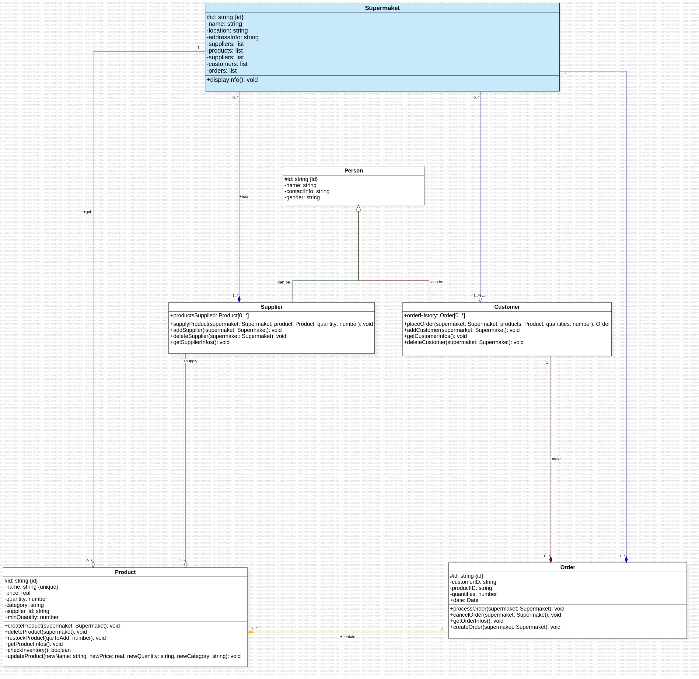

# TP-Inf-211

Managing a supermarket’s stock can be challenging, with numerous products, suppliers, and inventory processes to oversee. As a developer for Dovv Supermarket in Biyem-Assi, Yaounde you’ve been tasked with creating a stock management system. This system will organize products by categories, manage supplier and customer data, track product inventory, and streamline the ordering and restocking process.

## Students Informations

Name: Kenwou Barthez
Matricule: 22T2959

### Exercise 1: Define Classes and Attributes

Here I Identify and define the main classes necessary for the stock management system. For each class, I’ll list its attributes and methods

1 - Supermaket
    • Attributes: id, name, location, addressInfo, suppliers, products, customers, orders.
    • Methods: displayInfo().

2 - Supplier
    • Attributes: id, name, contactInfo, gender, productsSupplied
    • Methods: supplyProduct(), addSupplier(), getSupplierInfos(), deleteSupplier().

3 - Customer
    • Attributes: id, name, contactInfo, gender, orderHistory
    • Methods: placeOrder(), addCustomer(), getCustomerInfos(), deleteCustomer().
    • 
4 - Product
    • Attributes: id, name, price, quantity, category, supplier_id, 
    • Methods: createProduct(), restockProduct(), getProductInfos(), updateProduct(), deleteProduct().

5 - Order
    • Attributes: id, customer, products, quantities, totalPrice
    • Methods: processOrder(), cancelOrder(), getOrder(), createOrder().
### Exercise 2: Create a UML Diagram

Here I create a UML class diagram based on the classes and relationships defined
in Exercise 1 above; The diagram clearly show how the Product, Supplier, Customer, and Order classes relate to each other; Its Include inheritance, associations, and multiplicities; its also include key attributes and methods for each class.

The Diagramm was drawed with starUML app, and this picture show the result.
For mor information you can upload the model using the file “UML-diagram-TP.mdj” in  a root folder.



### Exercise 3: Create a UML Diagram

JavaScript Version : 
For this version we have to begin by make sure that a node is install (execute ```node –version``` my result: “v22.12.0”), and after that, make sure that packet who automatically generate ID is present, if is not present, we’ll install it using the command ```npm install``` or ```npm install uuid```.

To execute and test my files, me have to run the command: 
```node path_to_file/name_of_file.ext```

For example to run index file, the command is: 
```node index.js```
 For the Supermarket file, the command is: 
```node models/Supermaket.js```
(NB: This command supposing that y’re on the root of the project).

Python Version : 
For this version compliling file is more simple...Just make sure that y’ve python3 install on your computer on typing ```python3 –version``` for my own the result is ```Python 3.12.3```.
to execute some file, just type: ```python3 path_to_file/name_of_file.ext```
Just make sure that y’re on root dir.

C++Version :
Here is also relaively simple…
once in a root directory, 
-switched to build folder by executing : ```cd build```.
-Genereate the build file: ```cmake ..```
-Compile the projet: ```make```
- Execute the projet: ```./supermarket_app```

It’s also important to make sure that y’ve install this in local to avoid mistakes:```sudo apt-get update
sudo apt-get install uuid-dev```

 
Java Version :
Here is also simple to run the file, just run the command: 


Result:

For the test that I made, the result we be: 
```bash
        Supermarket Infos:
        -----------------
        
        ID: fdb66c5e-a314-44c1-8100-7b43d31dee15
        Name: DOVV
        Location: Odza B10
        Address Info: dovv-suppermaket@store.cm
        Suppliers: 0
        Products: 0
        Customers: 0
        Orders: 0
        
20 units added. New stock: 120
Product is on stock !

		Supplier Infos:
		-----------------
		
		ID: 7b022177-22db-4f65-bc2a-7d302106e075
		Name: Supplier A
		Contact Info: supplierA@example.com
		Sexe: Male
		Products Supplied: 0
		
Supplier "Supplier A" added to supermarket "DOVV".

		Customer Infos:
		-----------------
		
		ID: 51dec104-aa5d-47f9-898e-84c830e5b593
		Name: Customer B
		Contact Info: customer@example.com
		Sexe: Female
		Order History: 0
		
Customer "Customer B" added to supermarket "DOVV".

		Order Infos:
		-----------------
		
		ID: bae302ed-789c-4584-b454-abe8e9368963
		Customer ID: [ CustomerID123 ]
		Product ID: [ undefined ]
		Quantity: 10
		
Product successful added to the supermaket "DOVV" !
Order have been placed succefully !
This order has just successfully been deleted!


End of my tests !!! 😄️
```

We can add more actions, test, more methods or manage of differents maners…

## Conclusion
Thanks for reading, thank for this work.
